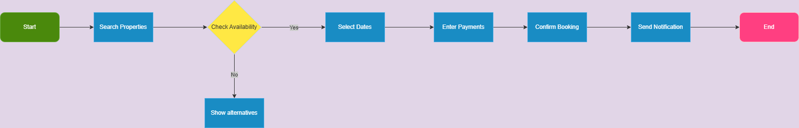

# Booking Process Flowchart

## Overview
This flowchart visualizes the property booking workflow in the Airbnb Clone system.

## Process Steps
1. **Start** → Guest initiates booking
2. **Search Properties** → Filters listings by preferences
3. **Select Dates** → Chooses check-in/check-out
4. **Check Availability** → System verifies if property is open
   - If available: Proceeds to payment
   - If unavailable: Shows alternative options
5. **Enter Payment** → Collects payment details
6. **Confirm Booking** → Creates reservation record
7. **Send Notifications** → Alerts guest and host
8. **End** → Process completes

## Flowchart

## Key
- Oval: Start/End points
- Rectangle: Process steps
- Diamond: Decision point
- Arrows: Flow direction
